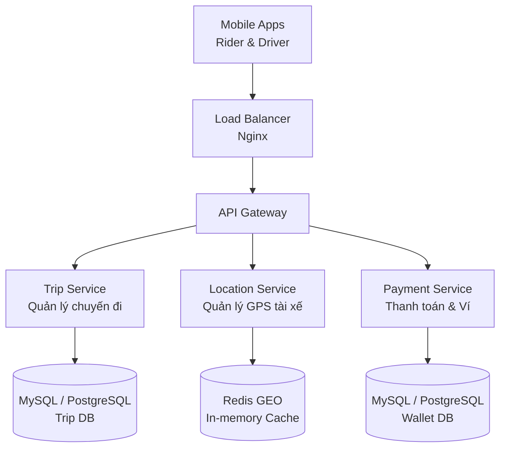

# RideNow V1 - 1-Page Design Document

## 1. Yêu cầu hệ thống (Requirements)

**Yêu cầu chức năng cốt lõi (Functional MVP):**
- Khách hàng (Rider) có thể tìm và đặt xe.
- Tài xế (Driver) có thể nhận cuốc xe.
- Tài xế liên tục cập nhật vị trí GPS lên hệ thống.
- Xử lý thanh toán khi chuyến đi kết thúc.

**Yêu cầu phi chức năng (Non-Functional):**
- Hỗ trợ **100,000 chuyến/ngày** và **10,000 tài xế active**.
- Ứng dụng phải hoạt động mượt mà ngay cả khi đường truyền di động chập chờn (High Availability).
- Độ trễ ghép xe thấp, tránh việc tài xế phải chờ quá lâu.
- Tuyệt đối không để xảy ra sai sót dữ liệu tiền bạc (Strong Consistency).

---

## 2. Ước lượng tải (Capacity Estimation)
*(Đã phân tích chi tiết tại phần tính toán Back-of-the-envelope)*
- **QPS (Khách hàng đặt xe):** Cực nhỏ, trung bình **5 QPS**, Peak **25 QPS**.
- **QPS (Tài xế bắn GPS):** Rất lớn, trung bình **2,000 QPS**, Peak **5,000 QPS**.
- **Storage:** Lịch sử chuyến đi rất nhẹ (~**36GB/năm**). Lịch sử GPS khổng lồ (~**7.3TB/năm**).

---

## 3. High-Level Design (Kiến trúc Tổng quan)

**Luồng dữ liệu (Data Flow) - Giao tiếp Client/Server:**
1. Khách hàng bấm đặt xe: Client gọi `POST /ride`.
2. API Gateway định tuyến sang `Trip Service`. Service lưu thông tin vào DB trạng thái "Đang tìm xe" và trả về ngay mã `HTTP 202 (Accepted)` kèm theo mã chuyến đi `trip_id`.
3. Client của Khách hàng bắt đầu vòng lặp **Short-Polling** (ví dụ: cứ 3 giây gọi `GET /ride/{trip_id}/status` 1 lần) để hỏi xem hệ thống đã tìm được tài xế chưa.
4. `Trip Service` gọi sang `Location Service` (đọc từ Redis) để quét tìm 5 tài xế gần nhất.
5. Sau khi tài xế bấm "Nhận cuốc", `Trip Service` cập nhật trạng thái. Ở lần Polling tiếp theo, Khách hàng sẽ nhận được thông tin tài xế.

---

## 4. Quyết định Đánh đổi & Định lý CAP (Trade-offs)

### A. Dịch vụ Vị trí (Location Service) - Chọn **AP**
- **Quyết định:** Ghi thẳng tọa độ GPS vào bộ nhớ RAM (Redis) thay vì Database.
- **Giải thích (CAP):** Dịch vụ này ưu tiên tính Khả dụng (**Availability**). Dùng mô hình **Eventual / Weak Consistency**. Khi mạng chập chờn, thà bị rớt vài điểm tọa độ hoặc cập nhật trễ vài giây (khách thấy xe khựng lại trên bản đồ) còn hơn là báo lỗi sập ứng dụng tài xế.
- **Storage:** Việc lưu trữ GPS siêu khổng lồ (7.3TB) sẽ không ghi trực tiếp. Redis chỉ lưu tọa độ *hiện tại*. Sau này có thể viết 1 con Worker chạy ngầm gom batch tọa độ đẩy ra AWS S3 (Cold Storage) để vẽ lại lộ trình (nếu cần).

### B. Dịch vụ Thanh toán (Payment Service) - Chọn **CP**
- **Quyết định:** Sử dụng Database quan hệ (RDBMS) có hỗ trợ giao dịch ACID nghiêm ngặt.
- **Giải thích (CAP):** Dịch vụ này ưu tiên tính Nhất quán (**Consistency**). Dùng mô hình **Strong Consistency**. Nếu đứt mạng (Network Partition), hệ thống lập tức khóa giao dịch và báo "Lỗi/Đang chờ xử lý", tuyệt đối không trừ tiền khống hoặc trừ tiền 2 lần (Double-spending).

### C. Cơ chế Ghép xe (Polling vs WebSocket)
- **Quyết định:** Chọn Short-Polling (Client chủ động gọi hỏi thăm) cho V1 thay vì dùng WebSocket/SSE (Server chủ động đẩy data).
- **Đánh đổi:** Polling tốn băng thông và tốn số lượng connection vô ích. Tuy nhiên, nó cực kỳ **dễ cài đặt và triển khai** cho MVP V1. Khi hệ thống lớn mạnh hơn (Sang Module 4/5), ta sẽ đổi sang WebSocket hoặc Async Kafka để tối ưu tài nguyên.
