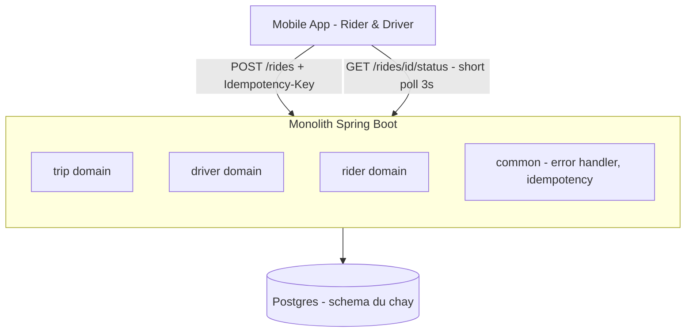
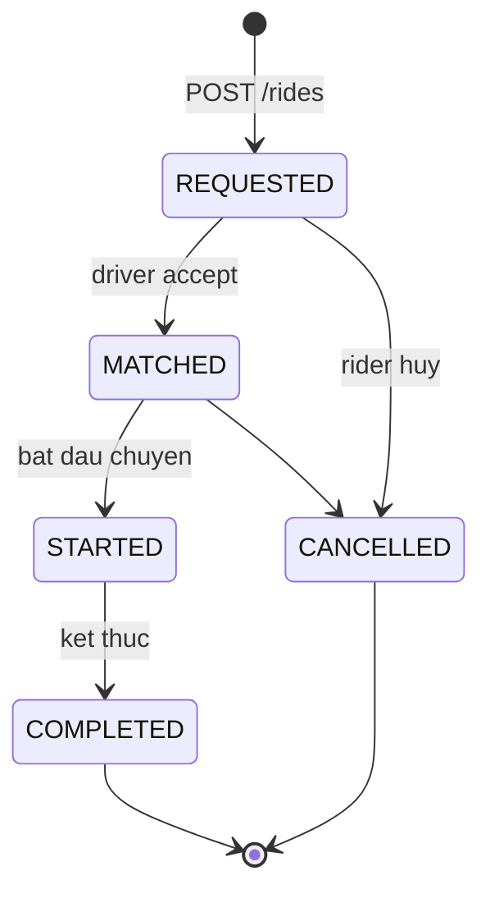

# RideNow — Milestone M1: Communication & API Design (nền REST + idempotency)

> **Roadmap:** bảng tiến hoá dòng "M0–M1" + Module 1 (Thực hành → Flagship)
> **Builds on:** `design-docs/M0-ridenow-v1-design-doc.md` (V1)
> **Concepts:** REST resource design, HTTP semantics, idempotency, transaction cơ bản, OpenAPI

---

## 1. Mục tiêu milestone
Biến RideNow từ skeleton → **monolith Spring Boot** có REST API chuẩn cho luồng cốt lõi: đăng ký rider/driver, tạo yêu cầu đi xe, xem trạng thái chuyến (short-polling như V1). Có Swagger, chuẩn lỗi thống nhất, idempotency cho "đặt xe".

## 2. Kiến trúc sau milestone (nhìn là biết build gì)

Vòng đời chuyến (state machine cần enforce):

## 3. Yêu cầu chức năng
- [ ] Đăng ký rider; đăng ký driver.
- [ ] Rider đặt xe: `POST /rides` (điểm đón/đến) → trạng thái `REQUESTED`, trả **202 Accepted** + `tripId` (đúng design doc V1).
- [ ] `GET /rides/{id}/status` — cho client short-poll.
- [ ] Driver nhận cuốc: `POST /rides/{id}/accept` → `MATCHED` (matching **thật** để M4).
- [ ] Vòng đời: `REQUESTED → MATCHED → STARTED → COMPLETED` (+ `CANCELLED`).

## 4. Yêu cầu kỹ thuật / kiến trúc
- [ ] Package **theo domain**: `trip` / `driver` / `rider` / `common` (CLAUDE.md), KHÔNG theo layer.
- [ ] REST chuẩn: resource số nhiều, status đúng ngữ nghĩa (**201** tạo, **202** accepted, **404**, **409** conflict trạng thái, **422** validation).
- [ ] Header **Idempotency-Key** cho `POST /rides` (tái dùng cơ chế kata `m1-01-idempotency-key`).
- [ ] Error format thống nhất qua `@ControllerAdvice` (mã lỗi + message).
- [ ] `@Transactional` cho tạo chuyến (atomic).
- [ ] OpenAPI (springdoc) expose `/swagger-ui`.
- [ ] Timestamp = **Instant (UTC)**.

## 5. Definition of Done
- [ ] Swagger UI liệt kê đủ endpoint, thao tác thử được.
- [ ] Test: đặt xe **2 lần cùng Idempotency-Key → chỉ 1 trip**.
- [ ] Test: chuyển trạng thái sai (accept trip đã `COMPLETED`) → **409**.
- [ ] State machine enforce, không nhảy trạng thái bậy.
- [ ] README "Architecture snapshot" mô tả monolith + luồng đặt xe.

## 6. Trade-off cần chốt → ADR
- [ ] **ADR-0002:** Short-polling cho V1 vs WebSocket/SSE (chính thức hoá từ design doc — polling tốn connection nhưng dễ triển khai MVP).
- [ ] **ADR-0003:** Idempotency store cho đặt xe — Redis vs DB (nối kata m1-01).

## 7. Docs bắt buộc cập nhật (khi làm xong)
- [ ] `README.md`: Current stage = "M1 — REST API + idempotency (monolith)"; điền Architecture snapshot.
- [ ] Thêm ADR ở `docs/adr/`.
- [ ] Append `../../learning-log.md`.

## 8. Câu hỏi phỏng vấn milestone phục vụ
- "Đảm bảo API đặt xe không tạo 2 chuyến khi client retry?" (idempotency)
- "Khi nào trả 202 vs 201? 409 vs 422?"
- "REST versioning / pagination / filtering chuẩn thế nào?"
