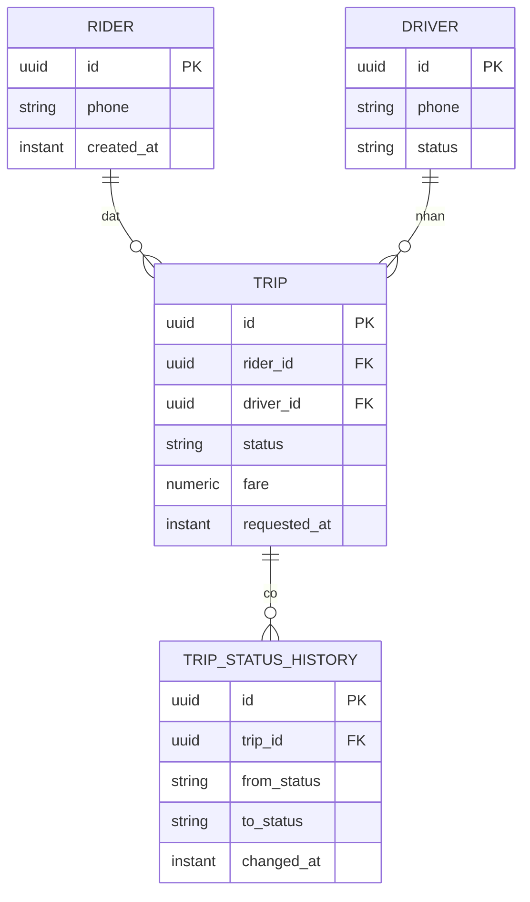
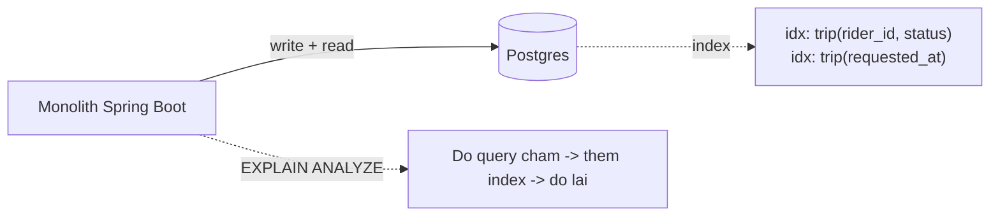

# RideNow — Milestone M2: Databases (schema nghiêm túc + tuning)

> **Roadmap:** bảng tiến hoá dòng "M2" + Module 2 (Thực hành → Flagship)
> **Builds on:** M1 (REST monolith)
> **Concepts:** ACID/transaction, index, EXPLAIN, N+1, keyset pagination, lịch sử chuyến

---

## 1. Mục tiêu milestone
Chuyển RideNow sang **Postgres nghiêm túc**: schema có index hợp lý, transaction cho tạo chuyến, thêm **bảng lịch sử chuyến**; cố ý tạo & sửa vài query chậm. Đây là module nặng nhất — làm chậm cũng được.

## 2. Kiến trúc / mô hình dữ liệu sau milestone

## 3. Yêu cầu chức năng
- [ ] Thêm **bảng lịch sử chuyến** (`trip_status_history`) — ghi mỗi lần đổi trạng thái.
- [ ] API xem lịch sử chuyến của 1 rider/driver — **có phân trang**.
- [ ] Query "chuyến gần đây" dùng **keyset pagination**, không OFFSET lớn.

## 4. Yêu cầu kỹ thuật / kiến trúc
- [ ] Schema Postgres thật (thay H2/in-memory nếu M1 dùng tạm); migration bằng Liquibase/Flyway.
- [ ] **Composite index** đúng theo mệnh đề WHERE + ORDER BY của các query list.
- [ ] Transaction cho tạo chuyến + ghi history (atomic, cùng 1 transaction).
- [ ] Loại bỏ **N+1** khi load trip kèm rider/driver (`@EntityGraph`/fetch join — cấm `FetchType.EAGER`).
- [ ] Đọc `EXPLAIN ANALYZE` cho ≥2 query, lưu output trước/sau tuning vào docs.

## 5. Definition of Done
- [ ] Seed dữ liệu lớn (vd ~1–2 triệu trip) bằng script để tuning có ý nghĩa.
- [ ] ≥1 query: `Seq Scan → Index Scan`, đo latency giảm bao nhiêu lần (số liệu thật).
- [ ] N+1 khi list trip bị khử: từ N+1 query → 1–2 query (đếm được).
- [ ] Phân trang list dùng keyset; giải thích vì sao không dùng OFFSET.

## 6. Trade-off cần chốt → ADR
- [ ] **ADR:** vì sao **chưa shard** (36GB/năm trip → 1 Postgres thừa sức; shard là giải pháp cuối) — nối kết luận kata M0 estimation.
- [ ] **ADR:** chọn `shard key` dự kiến cho tương lai (nếu phải shard trip) và vì sao.

## 7. Docs bắt buộc cập nhật (khi làm xong)
- [ ] `README.md`: Current stage = "M2 — Postgres + indexing + trip history"; cập nhật Architecture snapshot (thêm datastore + bảng history).
- [ ] ADR ở `docs/adr/`.
- [ ] Append `../../learning-log.md`.

## 8. Câu hỏi phỏng vấn milestone phục vụ
- "Query này chậm, debug thế nào?" (EXPLAIN → index/N+1)
- "Phân biệt sharding / replication / partitioning / federation."
- "Khi nào bạn shard?" (→ khi đã hết cách rẻ hơn)
- "Keyset vs OFFSET pagination khác gì?"
