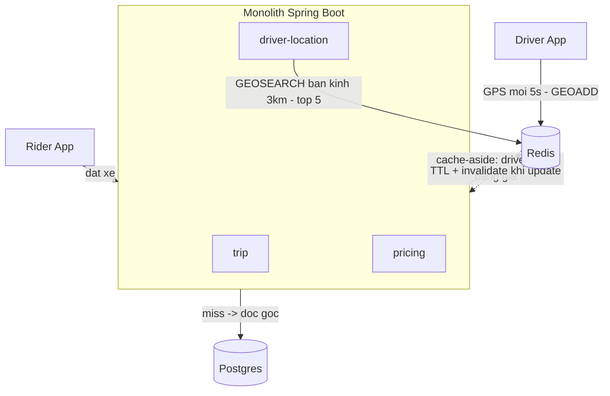

# RideNow — Milestone M3: Caching + Redis GEO (tìm tài xế gần nhất)

> **Roadmap:** bảng tiến hoá dòng "M3" + Module 3 (Thực hành → Flagship)
> **Builds on:** M2 (Postgres nghiêm túc)
> **Concepts:** cache-aside, TTL & invalidation, Redis GEO, cache pitfalls (stampede, hot key)

---

## 1. Mục tiêu milestone
Thêm **Redis** vào RideNow: cache-aside cho thông tin tài xế & bảng giá; dùng **Redis GEO** (`GEOADD`/`GEOSEARCH`) lưu vị trí tài xế hiện tại và **tìm 5 tài xế gần nhất**. Đặt TTL + chiến lược invalidation hợp lý. Đây là bước đầu tiên gánh luồng GPS nặng (5000 QPS) như đã ước lượng ở M0.

## 2. Kiến trúc sau milestone



```mermaid
sequenceDiagram
    participant R as Rider
    participant T as trip
    participant L as driver-location
    participant Rd as Redis GEO
    R->>T: POST /rides
    T->>L: tim tai xe gan diem don
    L->>Rd: GEOSEARCH (lat,lng, 3km, COUNT 5)
    Rd-->>L: 5 driver gan nhat
    L-->>T: danh sach ung vien
    Note over T: M3 chon thu cong/gia lap;<br/>matching that o M4
```

## 3. Yêu cầu chức năng
- [ ] Driver bắn GPS: `POST /drivers/{id}/location` → `GEOADD` vào Redis (vị trí *hiện tại*).
- [ ] `GET /drivers/nearby?lat&lng&radius` → `GEOSEARCH` trả top N tài xế gần nhất.
- [ ] Cache-aside cho: thông tin tài xế (đọc nhiều, đổi ít) và bảng giá.

## 4. Yêu cầu kỹ thuật / kiến trúc
- [ ] Cache-aside chuẩn: miss → đọc DB → set cache (TTL); update gốc → **invalidate** key.
- [ ] Redis chỉ lưu vị trí **hiện tại** (không lưu lịch sử — lịch sử 7.3TB/năm để batch ra cold storage sau, theo M0).
- [ ] Đặt **TTL hợp lý** + tránh nhiều hot key cùng hết hạn (TTL jitter — nối kata m3-02).
- [ ] Chọn cấu trúc Redis đúng: GEO (sorted set) cho vị trí, hash/string cho driver info.

## 5. Definition of Done
- [ ] `GET /drivers/nearby` trả đúng top N theo khoảng cách, chạy trên Redis GEO (không quét Postgres).
- [ ] Chứng minh cache-aside: lần 1 miss (đụng DB), lần 2 hit (không đụng DB) — đếm được.
- [ ] Có chiến lược invalidation khi driver info đổi (không để stale mãi).
- [ ] Nêu cách chống cache stampede cho hot key (lock/coalescing hoặc jitter).

## 6. Trade-off cần chốt → ADR
- [ ] **ADR:** Redis làm **cache** vs làm **store** cho vị trí GPS (AP, eventual — chấp nhận mất vài điểm, nối design doc V1).
- [ ] **ADR:** chiến lược cache-aside vs write-through cho driver info; TTL bao nhiêu và vì sao.

## 7. Docs bắt buộc cập nhật (khi làm xong)
- [ ] `README.md`: Current stage = "M3 — Redis cache-aside + GEO nearest driver"; cập nhật Architecture snapshot (thêm Redis).
- [ ] ADR ở `docs/adr/`.
- [ ] Append `../../learning-log.md`.

## 8. Câu hỏi phỏng vấn milestone phục vụ
- "Cache-aside vs write-through — chọn cái nào cho hệ thống của bạn?"
- "Cache stampede là gì, chống thế nào?"
- "Invalidate cache khi data gốc đổi thế nào?"
- "Vì sao vị trí GPS chọn AP + Redis chứ không ghi thẳng DB?"
