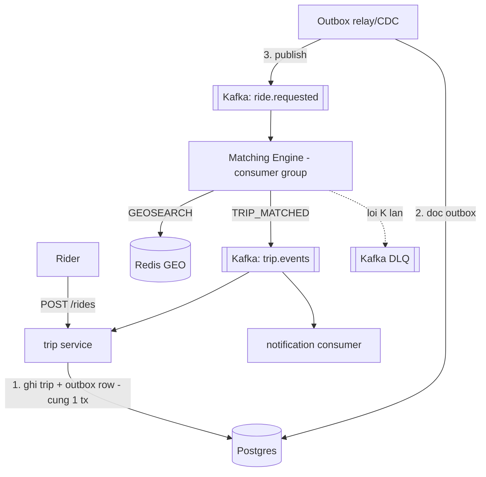
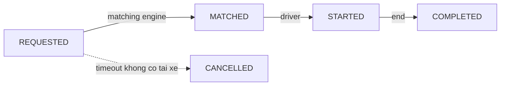

# RideNow — Milestone M4: Asynchronism & Kafka (matching engine + outbox)

> **Roadmap:** bảng tiến hoá dòng "M4" + Module 4 (Thực hành → Flagship)
> **Builds on:** M3 (Redis GEO tìm tài xế gần)
> **Concepts:** message queue, event-driven, competing consumers, outbox, DLQ, idempotent consumer

---

## 1. Mục tiêu milestone
Biến **matching tài xế thành bất đồng bộ qua Kafka**: request đặt xe đẩy vào topic, matching engine (consumer) tìm tài xế & phát event `TRIP_MATCHED`; các event vòng đời chuyến chạy qua queue; áp **outbox pattern** cho tạo chuyến + publish event. Đây là bước bỏ short-polling nặng, chuyển sang event-driven.

## 2. Kiến trúc sau milestone

Vòng đời chuyến giờ chạy bằng event:

## 3. Yêu cầu chức năng
- [ ] Đặt xe → publish `ride.requested` (qua outbox), trả `202` ngay.
- [ ] **Matching engine** (consumer): nhận `ride.requested` → GEOSEARCH → chọn tài xế → publish `TRIP_MATCHED`.
- [ ] Event vòng đời (`REQUESTED → MATCHED → STARTED → COMPLETED`) chạy qua topic `trip.events`.
- [ ] Notification consumer nhận event → (giả lập) gửi thông báo.

## 4. Yêu cầu kỹ thuật / kiến trúc
- [ ] **Outbox pattern**: ghi trip + outbox row trong **cùng 1 transaction**; relay đọc outbox → publish (tránh dual-write mất/nhân đôi event).
- [ ] **Idempotent consumer**: dedup theo `eventId`/`tripId` (nối kata m4-01) — event trùng không match 2 lần.
- [ ] **DLQ** cho message lỗi + retry giới hạn; poison message không kẹt partition.
- [ ] **Partition key** = `tripId` để giữ ordering trong 1 chuyến.
- [ ] Commit offset **sau** xử lý thành công (at-least-once + idempotent).

## 5. Definition of Done
- [ ] Đặt xe → matching engine tự match qua Kafka, không cần short-poll đồng bộ.
- [ ] Test: gửi trùng `ride.requested` → chỉ 1 lần match (idempotent).
- [ ] Test: message lỗi liên tục → vào DLQ, consumer chính vẫn chạy.
- [ ] Chứng minh outbox: kill app giữa "ghi DB" và "publish" → event **không mất** (relay publish lại).

## 6. Trade-off cần chốt → ADR
- [ ] **ADR:** Kafka vs RabbitMQ cho matching (throughput/replay vs routing linh hoạt).
- [ ] **ADR:** Outbox pattern vs publish trực tiếp trong transaction (dual-write problem).
- [ ] **ADR:** vì sao "exactly-once" là ảo tưởng → at-least-once + idempotent consumer.

## 7. Docs bắt buộc cập nhật (khi làm xong)
- [ ] `README.md`: Current stage = "M4 — Kafka matching engine + outbox"; cập nhật Architecture snapshot (thêm Kafka, matching engine, DLQ).
- [ ] ADR ở `docs/adr/`.
- [ ] Append `../../learning-log.md`.

## 8. Câu hỏi phỏng vấn milestone phục vụ
- "Đảm bảo không xử lý trùng message thế nào?" (idempotent consumer)
- "Outbox pattern giải quyết vấn đề gì?"
- "Kafka đảm bảo ordering thế nào? Consumer chậm hơn producer thì sao?"
- "DLQ để làm gì?"
