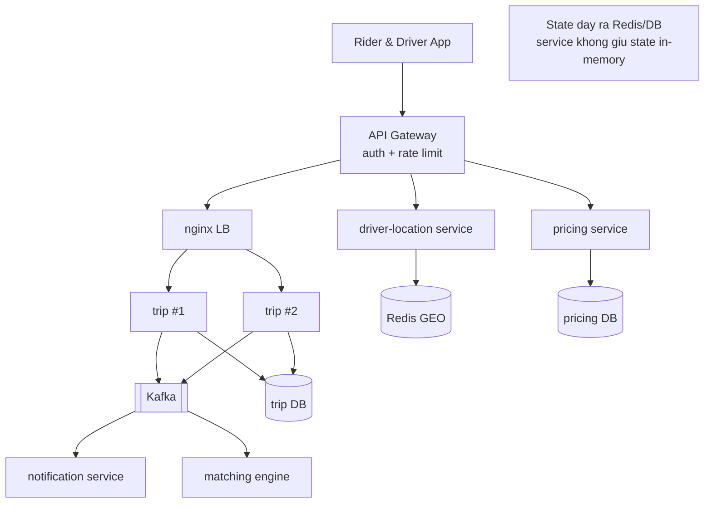

# RideNow — Milestone M5: Scalability & tách Microservices

> **Roadmap:** bảng tiến hoá dòng "M5" + Module 5 (Thực hành → Flagship)
> **Builds on:** M4 (Kafka event-driven — đã có ranh giới tự nhiên để tách)
> **Concepts:** microservices, stateless, load balancer, API gateway, service discovery

---

## 1. Mục tiêu milestone
Tách RideNow thành vài service (`trip`, `driver-location`, `pricing`, `notification`), đặt sau **API Gateway** (Spring Cloud Gateway) xử lý auth + rate limit; đảm bảo các service **stateless**; nginx làm LB cho instance. Lưu ý roadmap: **đừng tách sớm** — M4 đã tạo ranh giới event rõ ràng nên giờ tách mới hợp lý.

## 2. Kiến trúc sau milestone

## 3. Yêu cầu chức năng
- [ ] Mỗi domain M1–M4 tách thành service riêng, deploy độc lập được.
- [ ] Client chỉ nói chuyện qua **API Gateway** (1 entry point).
- [ ] Gateway xử lý cross-cutting: auth (JWT), rate limit, routing.

## 4. Yêu cầu kỹ thuật / kiến trúc
- [ ] Service **stateless** — không session in-memory; state đẩy ra Redis/DB (điều kiện scale ngang).
- [ ] `trip` chạy **≥2 instance** sau nginx LB, health check tự loại node chết (nối kata m5-01).
- [ ] Giao tiếp giữa service: **bất đồng bộ qua Kafka** cho event; đồng bộ (REST/gRPC) chỉ khi thật cần.
- [ ] Mỗi service **DB riêng** (database-per-service) — không chia sẻ schema.
- [ ] Gateway = Spring Cloud Gateway; rate limit dùng Redis (nối kata m6-01, chuẩn bị cho M6).

## 5. Definition of Done
- [ ] Gọi luồng đặt xe **xuyên nhiều service** qua gateway thành công.
- [ ] Kill 1 instance `trip` → request vẫn 200 (LB định tuyến lại).
- [ ] Chứng minh stateless: request cùng user rơi vào instance khác nhau vẫn đúng.
- [ ] Gateway chặn request thiếu auth / vượt rate limit.

## 6. Trade-off cần chốt → ADR
- [ ] **ADR:** monolith → microservices — ranh giới tách theo domain nào, chi phí (network, consistency, vận hành) đổi lấy gì.
- [ ] **ADR:** giao tiếp giữa service — async (Kafka) vs sync (REST/gRPC), chọn gì cho luồng nào.
- [ ] **ADR:** database-per-service vs shared DB.

## 7. Docs bắt buộc cập nhật (khi làm xong)
- [ ] `README.md`: Current stage = "M5 — microservices + API gateway + nginx LB"; **vẽ lại Architecture snapshot** (đây là thay đổi kiến trúc lớn nhất).
- [ ] ADR ở `docs/adr/`.
- [ ] Append `../../learning-log.md`.

## 8. Câu hỏi phỏng vấn milestone phục vụ
- "Monolith vs microservices — chọn gì cho startup 5 người? Vì sao?"
- "Làm sao service scale ngang được?" (stateless)
- "L4 vs L7 load balancing?"
- "API Gateway làm những việc gì?"
