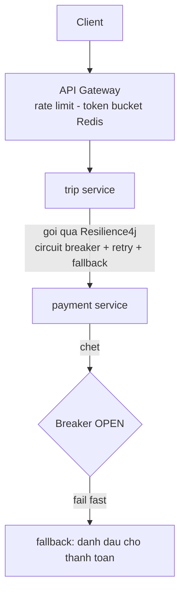
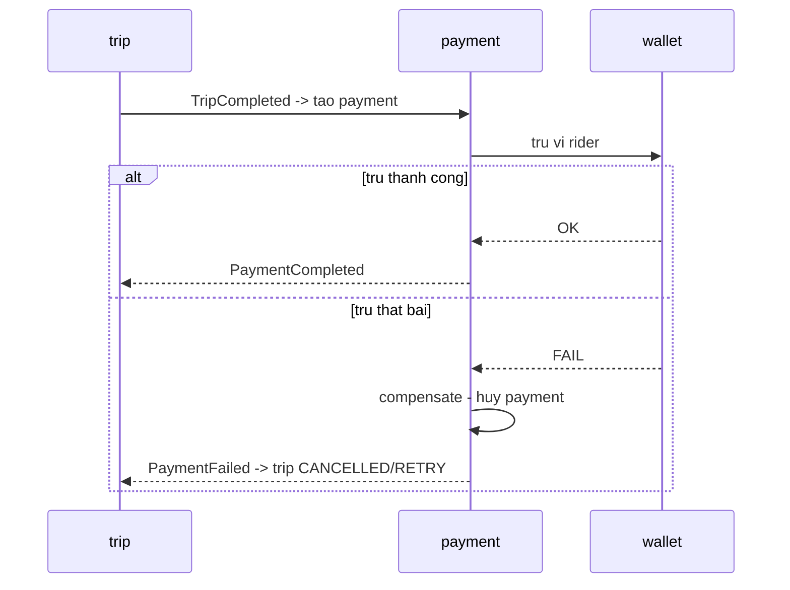

# RideNow — Milestone M6: Resilience & Reliability (breaker + saga)

> **Roadmap:** bảng tiến hoá dòng "M6" + Module 6 (Thực hành → Flagship)
> **Builds on:** M5 (microservices — giờ có lời gọi liên service cần bảo vệ)
> **Concepts:** circuit breaker, retry+backoff, rate limiting, bulkhead, saga, surge pricing

---

## 1. Mục tiêu milestone
Làm RideNow **sống sót ở production**: rate limiting ở gateway; circuit breaker cho pricing/payment; retry + backoff; **surge pricing**; áp **Saga** cho luồng thanh toán chuyến (trừ ví → nếu fail thì hoàn tác). Phân biệt "chạy được ở local" vs "sống được khi service phụ thuộc chết".

## 2. Kiến trúc / luồng sau milestone

Saga thanh toán (choreography) — có bước bù trừ:

## 3. Yêu cầu chức năng
- [ ] Rate limit ở gateway theo user/IP (`429` khi vượt) — nối kata m6-01.
- [ ] **Surge pricing**: giá tăng khi cầu > cung trong vùng (pricing service).
- [ ] Thanh toán chuyến khi `COMPLETED`: trừ ví → nếu fail thì **compensate** (hoàn tác), không để tiền treo.

## 4. Yêu cầu kỹ thuật / kiến trúc
- [ ] **Resilience4j** bọc lời gọi pricing/payment: circuit breaker + retry (backoff + jitter) + fallback + timeout (nối kata m6-02).
- [ ] Retry chỉ cho lỗi transient/idempotent (không retry lệnh trừ tiền không idempotent — nối M1).
- [ ] **Bulkhead**: cô lập thread pool cho từng dependency.
- [ ] **Saga** cho thanh toán: choreography qua Kafka event + compensating transaction; không dùng 2PC.
- [ ] Rate limiter phân tán qua Redis (đúng trên nhiều instance gateway).

## 5. Definition of Done
- [ ] Payment service chết → breaker **OPEN**, request trả fallback nhanh (không kẹt timeout), trip không sập theo.
- [ ] Saga: mô phỏng trừ ví fail → **compensate chạy**, số dư về đúng, không mất/treo tiền.
- [ ] Rate limit: bắn quá ngưỡng → đúng số `429`, đúng cả khi 2 instance gateway.
- [ ] Chứng minh retry có backoff không tạo retry storm.

## 6. Trade-off cần chốt → ADR
- [ ] **ADR:** Saga (choreography vs orchestration) cho thanh toán — vì sao **không** 2PC; đổi strong consistency lấy availability + eventual + compensation phức tạp.
- [ ] **ADR:** đặt rate limit ở gateway vs từng service.
- [ ] **ADR:** cấu hình circuit breaker (ngưỡng lỗi, wait duration) — chọn số theo cơ sở nào.

## 7. Docs bắt buộc cập nhật (khi làm xong)
- [ ] `README.md`: Current stage = "M6 — resilience (breaker, rate limit, saga payment)"; cập nhật Architecture snapshot.
- [ ] ADR ở `docs/adr/`.
- [ ] Append `../../learning-log.md`.

## 8. Câu hỏi phỏng vấn milestone phục vụ
- "Service B chậm/chết, làm sao A không sập theo?" (timeout + breaker + fallback + bulkhead)
- "Thiết kế rate limiter cho API." (câu cực hay ra)
- "Transaction xuyên nhiều service thế nào?" (Saga, vì sao không 2PC)
- "Exponential backoff + jitter để làm gì?"
