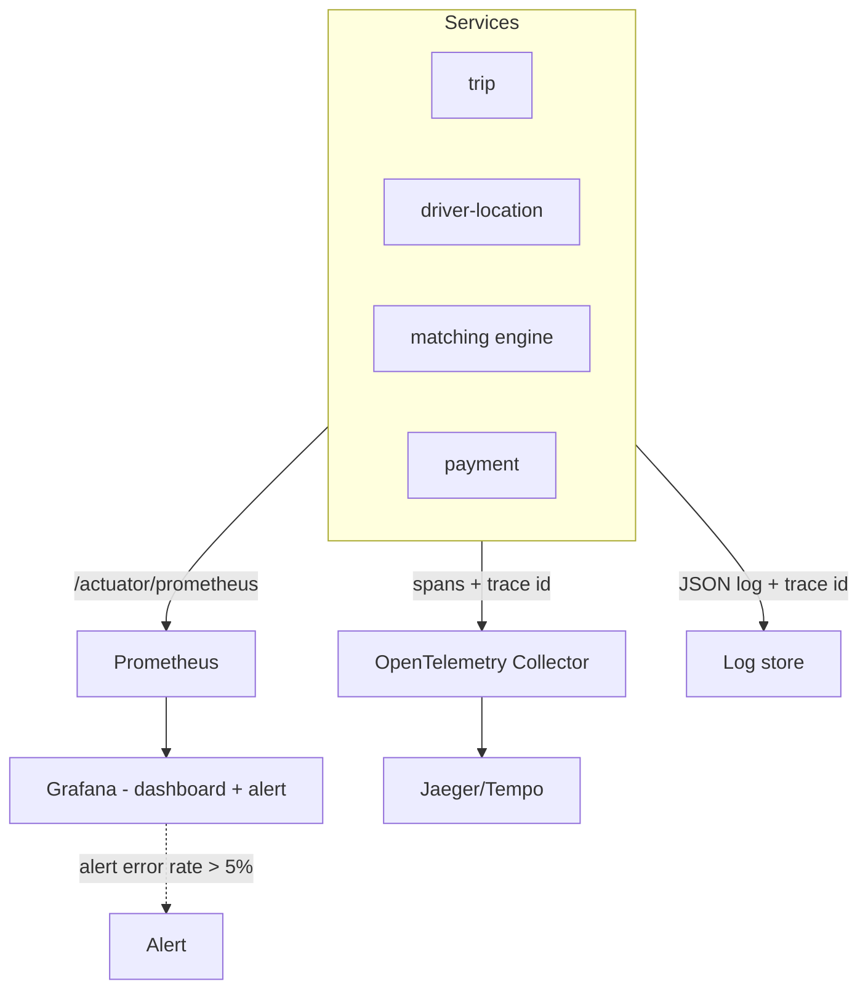
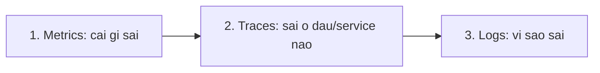

# RideNow — Milestone M7: Observability & Performance Antipatterns

> **Roadmap:** bảng tiến hoá dòng "M7" + Module 7 (Thực hành → Flagship)
> **Builds on:** M5/M6 (nhiều service — cần nhìn xuyên suốt để debug)
> **Concepts:** metrics, logs, traces; Prometheus/Grafana; OpenTelemetry; antipatterns

---

## 1. Mục tiêu milestone
Gắn **observability** cho RideNow: dashboard cho tỉ lệ match thành công, latency matching, Kafka lag; thêm **trace id xuyên các service** bằng OpenTelemetry; structured logging; cố ý tạo 1 antipattern (vd chatty I/O) rồi phát hiện qua trace và sửa.

## 2. Kiến trúc observability sau milestone

## 3. Yêu cầu chức năng (observability là "chức năng vận hành")
- [ ] Dashboard Grafana: **match success rate**, **latency matching (p95/p99)**, **Kafka consumer lag**, error rate, QPS.
- [ ] **1 alert** kích hoạt được (vd error rate > ngưỡng, hoặc Kafka lag tăng).
- [ ] Trace 1 request đặt xe đi xuyên gateway → trip → matching → notification.

## 4. Yêu cầu kỹ thuật / kiến trúc
- [ ] Actuator + Micrometer expose `/actuator/prometheus` ở mỗi service (nối kata m7-01).
- [ ] **OpenTelemetry**: propagate trace id qua REST **và** qua Kafka header (across async boundary).
- [ ] **Structured logging** (JSON) + correlation/trace id trong mỗi log line.
- [ ] Tạo có chủ đích 1 antipattern (chatty I/O / extraneous fetching = biến thể N+1 của M2) → phát hiện qua trace → sửa → đo lại.

## 5. Definition of Done
- [ ] Prometheus targets UP; dashboard đổi số thật khi bắn tải.
- [ ] Cố ý gây lỗi → alert **FIRING** (screenshot).
- [ ] 1 trace hiển thị đủ span xuyên ≥3 service (kể cả qua Kafka).
- [ ] Antipattern: có số liệu trước/sau khi sửa (vd số call, latency giảm).

## 6. Trade-off cần chốt → ADR
- [ ] **ADR:** chọn tín hiệu nào để alert (tránh alert fatigue) — vì sao p99 chứ không average.
- [ ] **ADR:** mức độ tracing (sampling rate) — full trace tốn tài nguyên vs mất tín hiệu.

## 7. Docs bắt buộc cập nhật (khi làm xong)
- [ ] `README.md`: Current stage = "M7 — observability (metrics + tracing + alert)"; cập nhật Architecture snapshot (thêm Prometheus/Grafana/OTel).
- [ ] ADR ở `docs/adr/`.
- [ ] Append `../../learning-log.md`.

## 8. Câu hỏi phỏng vấn milestone phục vụ
- "Production chậm/lỗi, điều tra từ đâu?" (metrics → traces → logs)
- "Phân biệt metrics, logs, traces."
- "Distributed tracing giúp gì trong microservices?"
- "Vì sao nhìn p99 thay vì average?"
