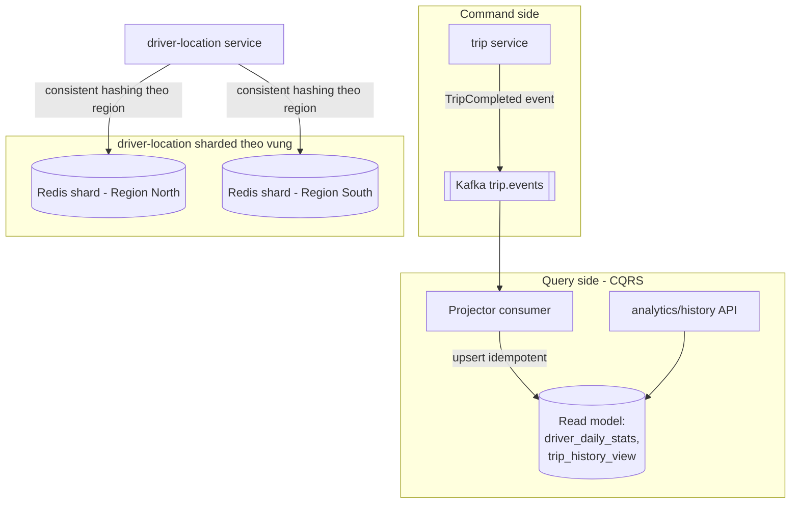

# RideNow — Milestone M8: Advanced Patterns (CQRS + sharding) & ghép nối

> **Roadmap:** bảng tiến hoá dòng "M8" + Module 8 (Thực hành → Flagship)
> **Builds on:** M4 (event) + M7 (observability) — hệ đã đủ chín để áp pattern nâng cao
> **Concepts:** CQRS, materialized view, event sourcing (nhẹ), sharding, denormalization

---

## 1. Mục tiêu milestone
Áp **CQRS + materialized view** cho **lịch sử & thống kê chuyến đi** (đường ghi qua Kafka event, đường đọc là view tối ưu); **shard `driver-location` theo vùng địa lý**. Và tổng duyệt lại toàn hệ thống RideNow như một bài System Design hoàn chỉnh. Điểm chín: biết nói **chỗ nào KHÔNG cần CQRS**.

## 2. Kiến trúc sau milestone

## 3. Yêu cầu chức năng
- [ ] **Command side**: hoàn tất chuyến → phát event `TripCompleted`.
- [ ] **Read side**: projector cập nhật read model (`driver_daily_stats`: số chuyến/doanh thu theo tài xế/ngày; `trip_history_view` denormalized).
- [ ] **Query API** đọc thẳng read model (không join write side) — phục vụ lịch sử & analytics.
- [ ] `driver-location` shard theo vùng địa lý.

## 4. Yêu cầu kỹ thuật / kiến trúc
- [ ] Read model **denormalized**, dựng đúng hình dạng query cần; **eventual consistency**.
- [ ] Projector **idempotent** (upsert theo `eventId`/`(driverId, day)` — nối M4/kata m8-01), event trùng không cộng đôi.
- [ ] Có thể **rebuild** read model từ chuỗi event (chạm nhẹ event sourcing).
- [ ] Shard `driver-location` theo **region** (consistent hashing — nối kata m2-02); nêu cách xử lý hot region.
- [ ] Xác định rõ ranh giới: phần **strong** (ví/thanh toán) **không** đẩy qua đường đọc eventual này.

## 5. Definition of Done
- [ ] Ghi lệnh → sau độ trễ ngắn, query read model phản ánh đúng (stats cộng dồn đúng); đo được cửa sổ eventual consistency (ms).
- [ ] Event trùng → read model không cộng nhầm (test idempotent).
- [ ] `driver-location` phân phối qua ≥2 shard theo vùng, tra cứu đúng shard.
- [ ] Viết đoạn **"chỗ nào KHÔNG dùng CQRS trong RideNow"** (vd CRUD tài xế đơn giản → thừa).
- [ ] **Tổng duyệt**: 1 trang trình bày RideNow end-to-end như bài phỏng vấn (requirements → estimation → high-level → deep dive → bottleneck).

## 6. Trade-off cần chốt → ADR
- [ ] **ADR:** CQRS ở đâu **có** dùng (history/analytics) và ở đâu **không** (tránh over-engineering).
- [ ] **ADR:** shard key cho `driver-location` = region — vì sao, và rủi ro hot region + cách re-balance.
- [ ] **ADR:** denormalization đánh đổi (đọc nhanh ↔ ghi phức tạp + dữ liệu trùng).

## 7. Docs bắt buộc cập nhật (khi làm xong)
- [ ] `README.md`: Current stage = "M8 — CQRS read model + sharded driver-location"; **cập nhật Architecture snapshot cuối cùng** (bản hoàn chỉnh để kể phỏng vấn).
- [ ] ADR ở `docs/adr/`.
- [ ] Append `../../learning-log.md`.

## 8. Câu hỏi phỏng vấn milestone phục vụ
- "CQRS là gì? Khi nào bạn KHÔNG dùng nó?"
- "Event sourcing đánh đổi gì?"
- "Read model bị lệch thì khôi phục thế nào?" (rebuild từ event)
- "Chọn shard key cho dữ liệu vị trí thế nào? Hot partition xử lý ra sao?"
- "Trình bày trọn vẹn kiến trúc RideNow." (tổng duyệt)
